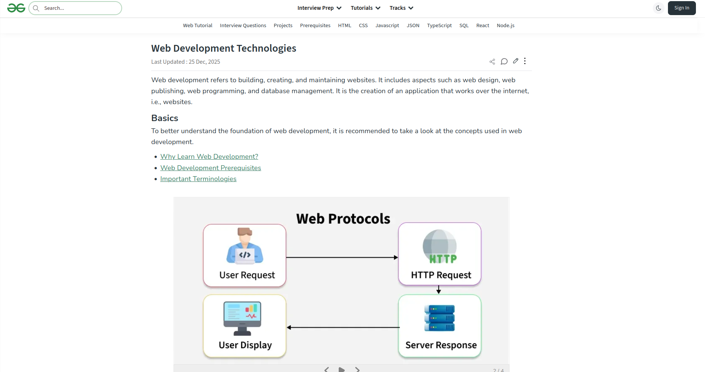
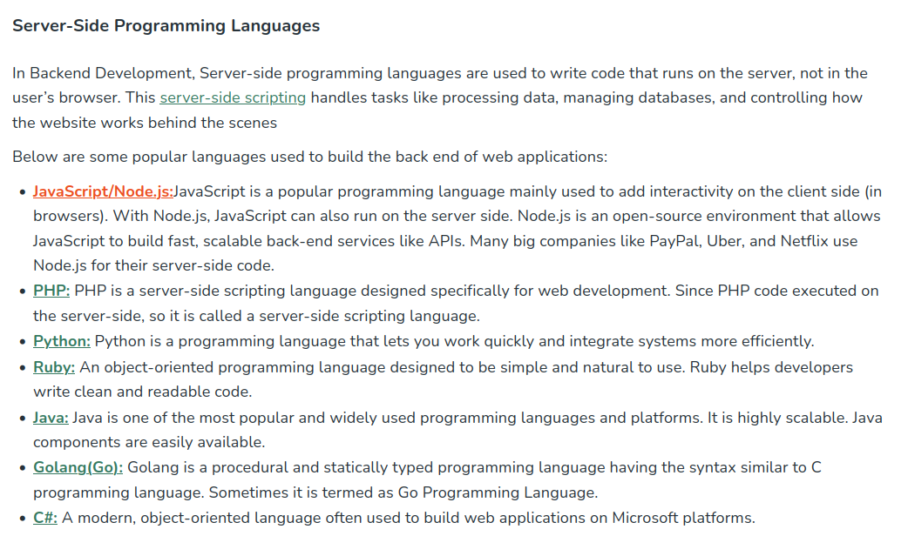

+++
title = 'Why I Avoid GeeksForGeeks'
author = 'Edwin Kofler'
date = 2026-01-04 23:50:36Z
categories = []
tags = []
draft = false
+++

GeeksForGeeks is among the most ubiquitous sites for programming and software development. I repeatedly see them when searching about web development, data structures, algorithms, system administration, cryptography, distributed systems, and more.


Not too long ago, when I mentioned to a friend that I avoided GeeksForGeeks, they became curious. When clarifying, I told them that I didn't like GeeksForGeeks because it's GeeksForGeeks.

I wanted to take an opportunity to externalize my tacit knowledge. GeeksForGeeks is somehow extremely popular, so hopefully this post may interest at least a few people.

First, I'll share the things that I notice during my "journey" through the site. Then, I'll summarize my findings and offer alternative websites.

## Journey

Let's start with the home page:


Everything is fine so far, no major complaints. Let's see what's under "Web Development":



Oh yeah, I should mention, I'm going to be ignoring things that aren't directly related to the programming content. For example, I'll be pretending that the the icons and text inside the top-left search bar didn't just noticably decrease a few hundred milliseconds after the rest of the page rendered. You won't be hearing any of that from me.

So, the page starts off well enough. I actually really like the use of slideshow to show complementing ideas. But let's get on with it; scrolling down we see:


Everything here is acceptable, I'm not going to be too much of a pedant here. But scrolling down is where we get a bit into trouble:


Including "DOM" under "JS Concepts" and "NodeJS" under "JS Frameworks/Libraries" is misleading. The DOM APIs aren't defined in [ECMAScript](https://262.ecma-international.org) and NodeJS is a JavaScript runtime environment, not just a library or framework. Sure - it's a digram, and you need to put things somewhere; but it only requires a little bit of thought to make things more accurate.

Specifically, putting "DOM" under a "JS APIs" section and "NodeJS" under a new "JS runtime environments" would be more accurate. That would make it possible to add "Deno", "Bun", "Fetch", "Web Storage", and "Intl" to the diagram, if wanted.

Things get a bit more crazy when moving to the backend development diagram:


The diagram doesn't make clear that `npm`, `yarn`, and `pnpm` are only really used for JavaScript projects. It's also weird to group those tools along with Git and GitHub under the title "Project Manager". This feels the most aggregious out of the errors so far.

It's time to switch gears and move on to some non-diagram things:



It's starts out fine, but it goes from mediocre to confusing for the bullet points.

For JavaScript/Node.js, it's the only bullet point that mentions use by big companies; am I to assume that those other languages aren't used by big companies? For PHP, they should mention it's deep role in early web development, and it's popularity. For Ruby, they don't mention Ruby on Rails, even though Ruby is usually only really used with Ruby on Rails.

In general, I think it's weird to mention superficial (in this context) attributes like "object-oriented language", "modern" , "widely used", and "easy to use". It's 2025 and all the most popular ("backend") languages are pretty much multi-paradigm and are easy enough to use. This isn't C++ or Bash.

But it's easy to criticize. This is what I'd write instead:

- **JavaScript/Node.js:** Node.js allows JavaScript to run on the server. Has the biggest collection of libraries/packages. The most common for newer developers to learn.
- **PHP:** Designed specifically for web development. Reached peak popularity in the late 2000s, but still extremely popular for web development. ~75% of all websites use PHP.
- **Python:** Not as popular as the others, but still has many frameworks & libraries. Usually not as performant as Node.js and PHP.
- **Ruby:** Almost always paired with Ruby on Rails for building websites. Used to be very popular during the 2010s; now, much less. Not as performant as Node.js and PHP.

I think you get the idea. The reader now has an accurate and clear idea of the very brief history, performance, and popularity of each of these choices. I'm sure it can be better, but I think it's a substantial improvement.

I'm almost done now. I'm going to visit 2 more pages. First, Node.js:


The sentence "It allows you to run JavaScript code outside the browser, making it ideal for building scalable server-side and networking applications" should use "making it possible" instead of "making it ideal". That more properly emphasizes that Node.js [was fundamental](https://www.youtube.com/watch?v=EeYvFl7li9E) for server-side JavaScript.

Also, `npm` [doesn't stand for](https://github.com/npm/cli#is-npm-an-acronym-for-node-package-manager) "Node Package Manager".

Scrolling down a bunch, there are a bunch of links to some Node.js topics. Let's click on "query string":


"Install Module" should come before "Importing Module", since that's actually done first. I hope I don't sound pedantic: that's something that might confuse beginners. Also, it's 2025, so it would be nice for the examples to use [ECMAScript modules](https://nodejs.org/api/esm.html) syntax instead of [CommonJS](https://nodejs.org/api/modules.html#modules-commonjs-modules), but I don't really expecct it.

Furthremore, it states that "[querystring] is not a global object, so [it needs to be installed explicitly]". That doesn't make sense, surely they meant to say that non-builtin modules require an explicit installation step.

The most _eggregious_ error is the use of the [`querystring`](https://www.npmjs.com/package/querystring) package. It's been deprecated for years. Even at the time when it wasn't deprecated, I'm pretty sure it was best practice to use [`qs`](https://www.npmjs.com/package/qs) instead. They also should have also mentioned [`URLSearchParams`](https://developer.mozilla.org/en-US/docs/Web/API/URLSearchParams), and also that that Node.js has a built-in module with the [same name](https://nodejs.org/api/querystring.html). Otherwise, since the `querystring` import doesn't have the Node.js-specific prefix/module specifier, the user may be unknowingly importing a different module.

## Summary

Hopefully, I have established that GeeksForGeeks is consistently:

- Incorrect
- Misleading
- Not up to date
- Missing important details

If they can't get the details right for web development, should they be expected to for any other topic?

And GeeksForGeeks is certainly not alone. For example, W3Schools was [notoriously](https://web.archive.org/web/20120405103802/http://w3fools.com) [unreliable](https://meta.stackoverflow.com/questions/280478/why-not-w3schools-com) until the late 2010s. [tutorialspoint](https://www.tutorialspoint.com/) shares many of the same problems. Nowadays, there are also AI-generated copycats that aren't even worth including in search results. Besides having bad information, these sorts of websites also:

- Omit authors on articles
- Publish in quantity, rather than with quality
- Excessively use third person pronouns in their "technical writing"

The presentation inconsistencies take attention away from the programming content. The conceptual inaccuracies seed distrust and disfavor.

To be clear, I'm not saying that GeeksForGeeks should _never_ be used. Sometimes, they're one of the only results that explains a topic in an accessible way. Many articles also include basic code snippets that are _mostly correct_. I'm only saying keep this information in mind when you read their technical writing.

## Alternatives

For web development, there is no shortage of supply of resources. I recommend these alternatives the most:

- [MDN](https://developer.mozilla.org)
- [web.dev](https://web.dev)
- [CSS Tricks](https://css-tricks.com)

From beginners to experts, the gold standard for HTML, CSS, and JavaScript is considered to be MDN. CSS Tricks is a delightful resource and web.dev is definitely worth mentioning. For a more comprehensive list that includes books, podcasts, and people, check out the [State of JS](https://2024.stateofjs.com/en-US/resources/) and [State of CSS](https://2024.stateofcss.com/en-US/resources/) surveys!

There are alternatives for other areas of computer science as well:

- **Web:** [JavaScript.info](https://javascript.info), [Piccalilli](https://piccalil.li), [Smashing Magazine](https://www.smashingmagazine.com/)
- **C/C++:** [Learn C++](https://learncpp.com), [CppReference](https://www.cppreference.com), [isocpp.org](https://isocpp.org)
- **Python:** [Official Python Tutorial](https://docs.python.org/3/tutorial/index.html), [RealPython](https://realpython.com/), [Python Morsels](https://www.pythonmorsels.com)
- **Data Structures & Algorithms:** [cp-algorithms.com](https://cp-algorithms.com), [algo.monster](https://algo.monster/problems/stats), [visualgo.net](https://visualgo.net), [USACO Guide](https://usaco.guide)

A bonus tip, if you want search results to show color like in the first image, install the [uBlacklist browser extension](https://ublacklist.github.io/). I have my own [configuration](https://github.com/hyperupcall/dotfiles/blob/trunk/config/ublacklist.txt) that includes:

```text
# Don't forget to map each number to a color in the configuration.
@3*://*.w3schools.com/*
@3*://*.geeksforgeeks.org/*
@1*://developer.mozilla.org/*
@2*://*.dev.to/*
@1*://*.joshwcomeau.com/*
```
